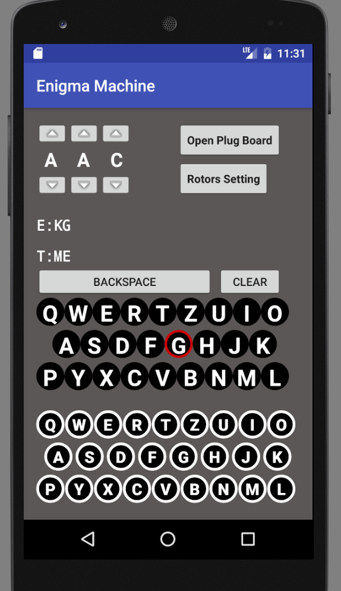
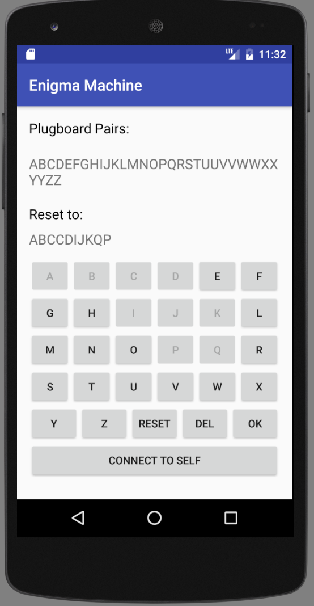
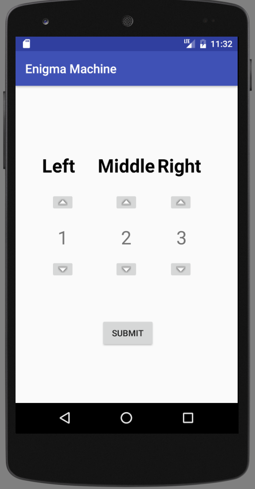

# Enigma Machine Simulator 
#####[What is an Enigma Machine?](https://en.wikipedia.org/wiki/Enigma_machine "Title")

###1. Red circle to indicate the encrypted letter for one input letter.

###2. Configure Plug Board

###3. Configure Rotors

